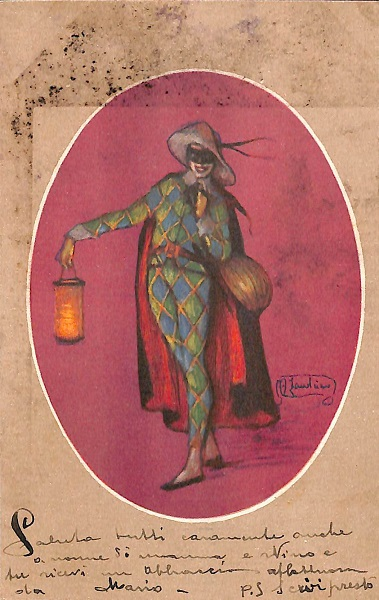

<h1> Codifica di Testi </h1> 

<h2> Progetto realizzato insieme a <a href="https://github.com/silviab98/CodificaTesti1920"> Silvia Bonaccorsi </a>  </h2>

Consegna progetto ed esercizi in itinere per il corso di Codifica di Testi, a.a. 2019/2020

<h3> Le cartoline codificate sono 7694-025 e 7694-035 </h3>

 Il progetto è incentrato sulla codifica e presentazione digitale di due cartoline risalenti alla Grande Guerra. 
Le cartoline sono state taggate in XML seguendo le linee guida P5 del consorzio TEI e trasformate tramite XSLT in un prodotto digitale consultabile open-source HTML. L'UI da cui si fruiscono le cartoline è stata arricchita con CSS e JavaScript/JQuery. 

